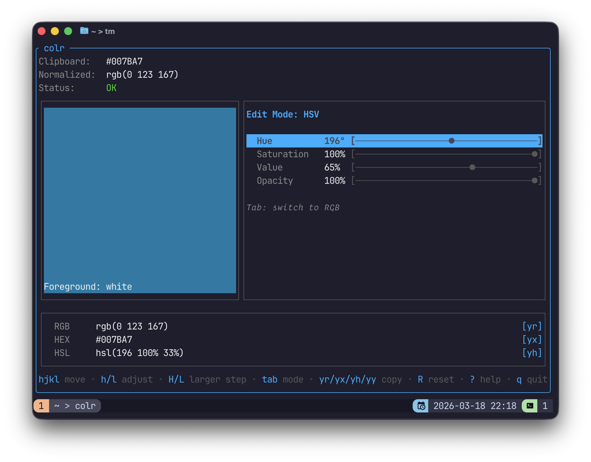

# colr

An interactive terminal color editor. Copy a CSS color to your clipboard, run
`colr`, and adjust it in real time — then copy the result back out in any
format.



## Disclaimer

I wrote this with the help of Claude Code and Codex (see docs/prompts).

## Usage

Copy a CSS color to your clipboard, then:

```
colr
```

Or pass a color directly:

```sh
colr "#ff8000"
colr 255 128 0
```

The app reads your clipboard on launch and opens a TUI showing a live preview,
an editor, and output formats. When you're done, copy the result with `yr`,
`yx`, or `yh` and quit with `q`.

## Keybindings

| Key            | Action                    |
| -------------- | ------------------------- |
| `j` / `k`      | Move between fields       |
| `h` / `l`      | Adjust value (small step) |
| `H` / `L`      | Adjust value (large step) |
| `g` / `G`      | First / last field        |
| `tab`          | Toggle HSV / RGB mode     |
| `1` / `2`      | Switch to HSV / RGB mode  |
| `yr` / `yy`    | Copy RGB to clipboard     |
| `yx`           | Copy HEX to clipboard     |
| `yh`           | Copy HSL to clipboard     |
| `R`            | Reset to original color   |
| `?`            | Help overlay              |
| `q` / `ctrl+c` | Quit                      |

Step sizes: small = 1 (1° for hue), large = 10 (10° for hue, 5% for other fields).

## Supported input formats

`colr` parses CSS color strings from the clipboard:

- **Hex:** `#RRGGBB`, `#RRGGBBAA`, `RRGGBB`, `RRGGBBAA`
- **RGB:** `rgb(R G B)`, `rgb(R, G, B)`, `rgba(R G B / A)`, `rgba(R, G, B, A)`
- **HSL:** `hsl(H S% L%)`, `hsla(H S% L% / A)`
- **Bare values:** `R G B`, `R, G, B`

Channel values accept integers (0–255) or percentages. Alpha accepts a decimal (0–1) or a percentage.

## Output formats

| Command     | Format | Example                                       |
| ----------- | ------ | --------------------------------------------- |
| `yr` / `yy` | RGB    | `rgb(255 128 0)` / `rgb(255 128 0 / 50%)`     |
| `yx`        | HEX    | `#FF8000` / `#FF800080`                       |
| `yh`        | HSL    | `hsl(30 100% 50%)` / `hsl(30 100% 50% / 50%)` |

Alpha is omitted when 100%, included as an integer percentage otherwise.

## Installation

**Homebrew (macOS / Linux):**

```sh
brew tap elentok/stuff
brew install --cask elentok/stuff/colr
```

**Go:**

```sh
go install github.com/elentok/colr@latest
```

**Build from source:**

```sh
git clone https://github.com/elentok/colr
cd colr
go build -o colr .
```

**Requirements:** Go 1.25+, a terminal with 256-color support.
